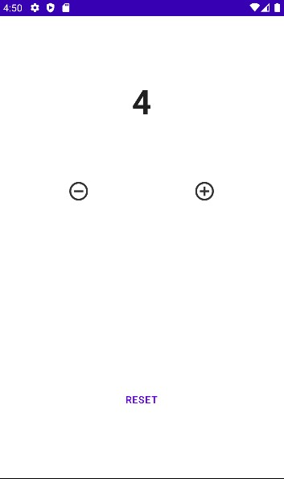

<h1 align="center">Counter</h1>

A simple counter app

This is a demo application to teach basics of Jetpack Compose and Android conducted by [GDSC NIT Delhi](https://github.com/GDSCNITD) on September 26, 2022.

## Screenshots

## Built With

- Android Studio
- Kotlin
- Jetpack Compose

## 🤝 Support

Give a ⭐️ if you like this project!